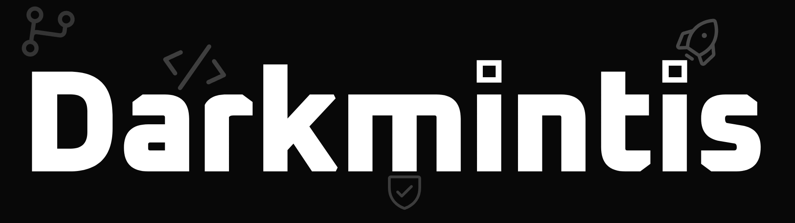

  

<strong>Software Developer • Rapid Prototyper • Shipping Real Apps</strong>

  

## What I Do

- **Software Development** → Build and ship real-world mobile and web products.
- **Rapid Prototyping** → Turn ideas into working apps fast.
- **Product Mindset** → Focus on usability, performance, and simplicity.

## Featured Project

### Blink
A Flutter-based image sharing app powered by Cloudflare, designed for fast and simple sharing.

- **Platform:** Android  
- **Stack:** Flutter, Dart, Cloudflare  
- **Status:** Published on Google Play  

---

  

